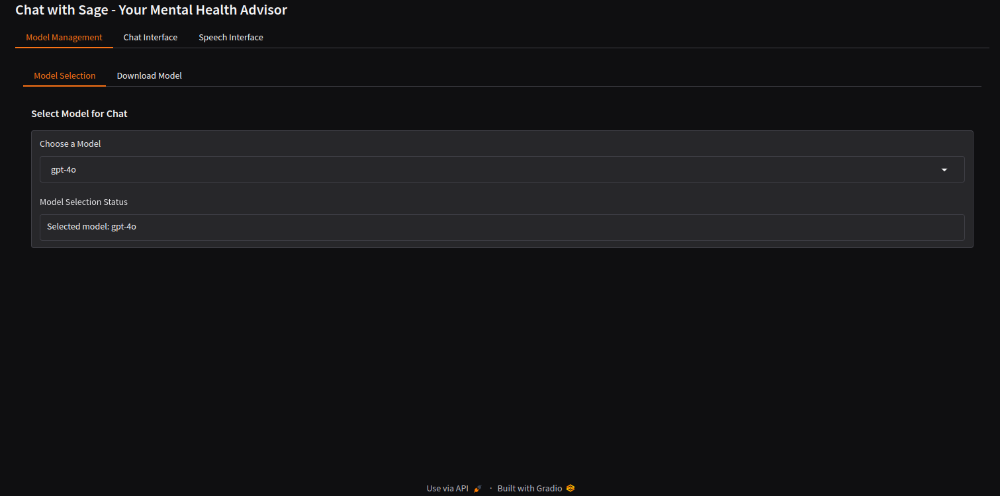
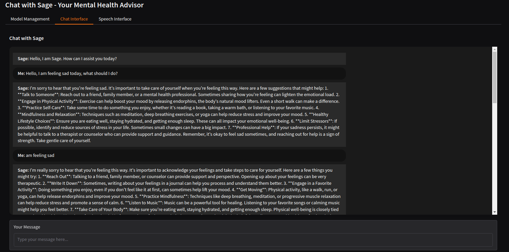
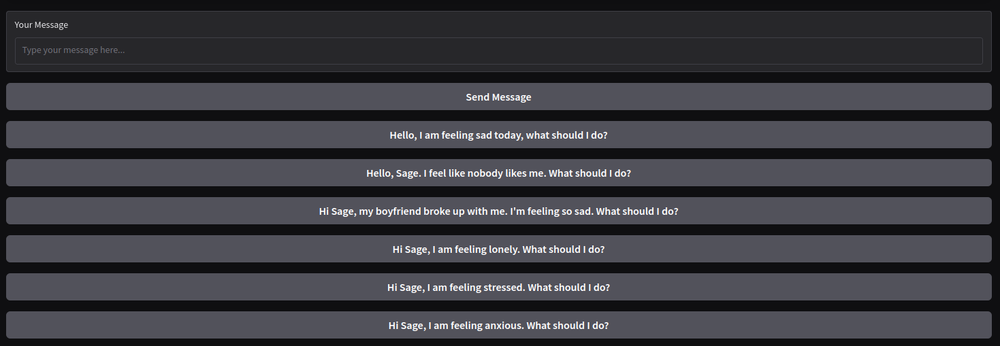
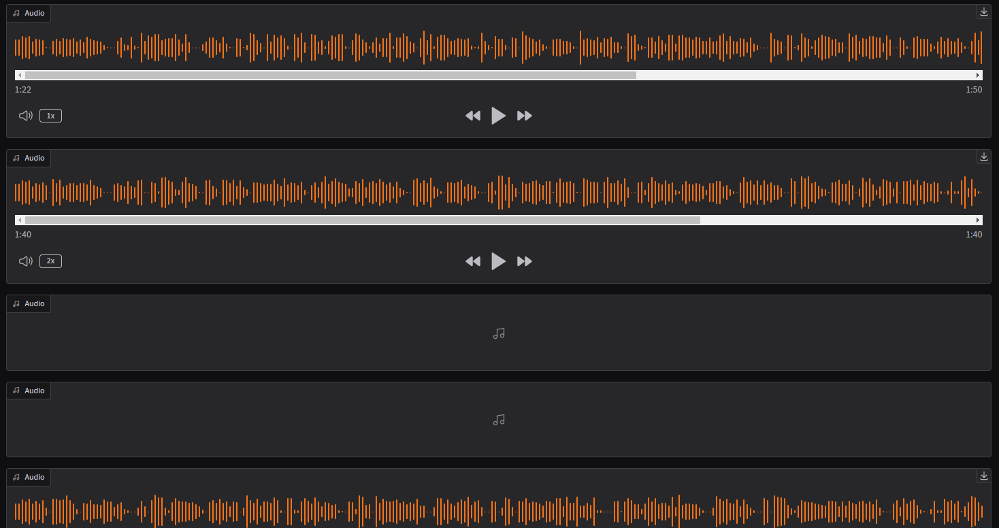
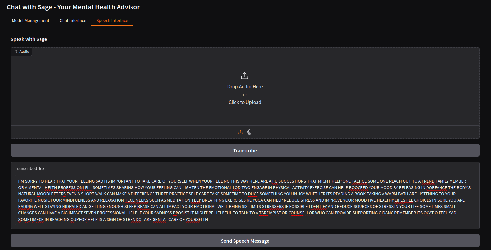
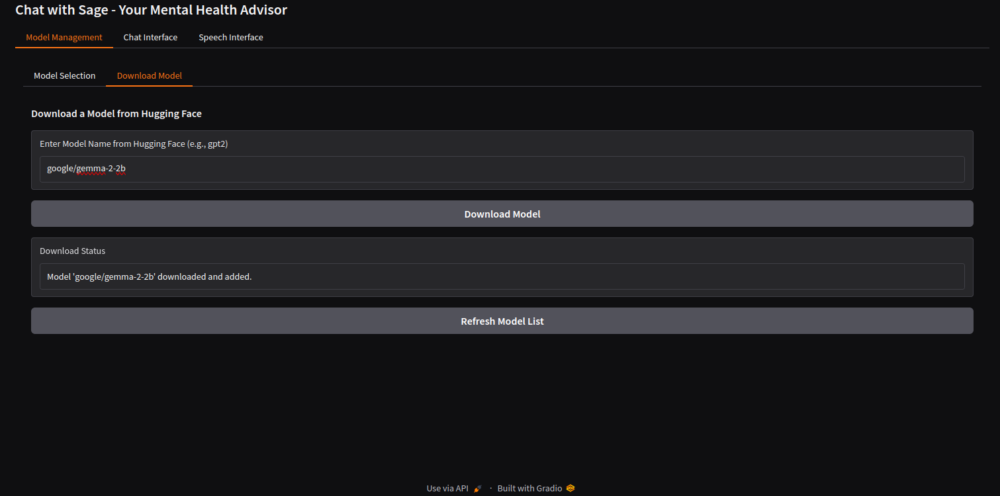

# Table of Contents
- [Introduction](#nvidia-ai-workbench-introduction)
   - [Project Description](#project-description)
   - [Prerequisites](#prerequisites)
- [App Features](#app-features)

## Project Description
This project focuses on developing a Mental Health application with a customizable Gradio Chat app. Key features include:
- Multi-Model Selection
- Download Your Own NLP Model from Hugging Face and Use Locally
- Interacting with a personalized chatbot that serves as your assistant.
- Improved Chat Interface with Automatic Audio Response
- Added Pre-Defined Messages
- Speech Interface

### Table 1: Tested Models

| Model Name                           | Model Type | Inference Mode | Model Description                                   |
|--------------------------------------|------------|----------------|-----------------------------------------------------|
| `GTP4-32K` | NLP        | `gradio api` |  Open AI GPT4-32K (Azure OpenAI API)                           |
| `gpt4`                               | NLP        | `gradio api`   | Open AI GPT4 (Azure OpenAI API)                     |
| `gpt4o`                              | NLP        | `gradio api`   | OpenAI GPT4o latest model (Azure OpenAI API)       |
| `GPT35_TURBO`                        | NLP        | `gradio api`   | OpenAI GPT35_TURBO (Azure OpenAI API)  |

**Note**: The models listed in Table 1 are tested and verified to work with the application. You can also choose any text generation model that supports transformers on hugging face. Some models downloaded will not be compatible with the version of **pytorch** Sage is running

## Prerequisites
- A Hugging face account and familiarity.

---

## System Requirements
Below are the minimum and recommended system requirements for the project:

| vRAM  | System RAM | Disk Storage | vCPU          | GPU                   |
|-------|------------|--------------|---------------|-----------------------|
| 32 GB | 16 GB      | 70 GB        | Intel Core i7 | At least 2 (optional) |

# App Features

### 1. Multi-Model Selection
   - **Description**: Users can now choose from multiple models for a more tailored experience. This feature supports different types of models (e.g., NLP, speech recognition) depending on the specific use case.
   - **Usage**: Select from a variety of models pre-loaded or uploaded locally. Each model is optimized for certain tasks, such as question answering, text generation, or translation, ensuring that users always have the best model for their needs.
   - **Benefits**: Enables flexibility, enhances accuracy, and allows users to optimize their workflows by switching models without restarting the application.

### 2. Download Your Own NLP Model from Hugging Face and Use Locally
   - **Description**: Users can now download and integrate custom NLP models from Hugging Face directly into their local environment.
   - **Setup**:
     1. Visit the [Hugging Face Model Hub](https://huggingface.co/models).
     2. Select and download your desired NLP model.
     3. Import the model into your application and set it up for local usage.
   - **Benefits**: This feature provides flexibility, allowing users to work offline, maintain data privacy, and customize their environment for specialized tasks.

### 3. Improved Chat Interface with Automatic Audio Response
   - **Description**: The chat interface now supports automatic audio responses. Users can choose to receive their responses in voice format for an enhanced, hands-free experience.
   - **Features**:
     - Text-to-speech conversion is available for each response.
     - Configurable audio playback options: Users can adjust volume, speed, and select different voices.
   - **Benefits**: This is especially useful for accessibility, multitasking, and for users who prefer auditory feedback over reading.

### 4. Added Pre-Defined Messages
   - **Description**: A set of pre-defined messages is available to simplify interactions and reduce response time.
   - **Usage**:
     - Choose from commonly used phrases or templates to quickly initiate conversations, respond to standard queries, or greet users.
     - Customize and add your own frequently used messages to the list.
   - **Benefits**: Increases efficiency by reducing typing time, promotes consistency in responses, and enables easy setup for new users.

### 5. Speech Interface
   - **Description**: Users can now record or upload audio, transcribe it, and send it to the model. The response can then be received in audio format, creating a full-circle voice interaction.
   - **Workflow**:
     1. Record a message directly within the application or upload an audio file.
     2. The audio is transcribed into text and processed by the model.
     3. The model's response is converted into speech and played back to the user.
   - **Benefits**: Ideal for hands-free interactions, accessibility, and situations where typing is inconvenient. It also enhances engagement by providing a more conversational experience.

---
### How to use the application
#### Select a model from the dropdown list.
You can select a model from the dropdown list. The models are pre-loaded and optimized for different tasks such as question answering, text generation, or translation. 

#### Chat with the AI
Once you have selected a model, you can start chatting with the AI. Type your message in the chat box and press Enter to send it. The AI will respond with the generated text and read out the text amd read out the audio.

Using pre-defined message or text input the send message button

Audio can be controlled by increasing speed, pausing and more.

#### Speech Interface
You can also record or upload audio to interact with the AI. Click on the microphone icon to start recording or upload an audio file. The AI will process the audio and respond with the generated text and audio.

#### Download model from Hugging Face
You can download your own NLP model from Hugging Face and use it locally in the application. This feature provides flexibility, allowing users to work offline, maintain data privacy, and customize their environment for specialized tasks.

